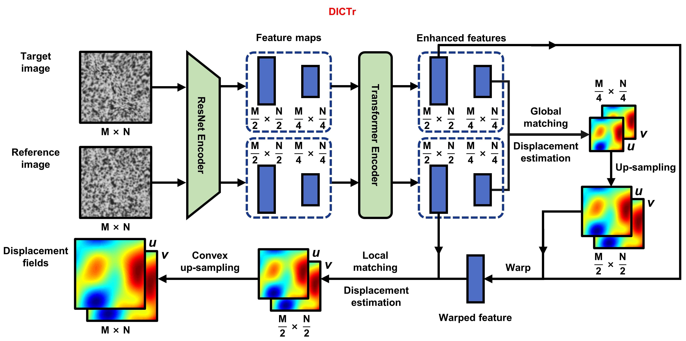
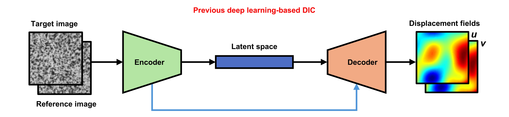

# DICTr: Digital image correlation based on transformer

## Introduction

A DIC network developed based on GMFlow for high accuracy measurement of deformation.



**Different from previous models that construct feature maps to directly establish the relationship between grayscale value changes and the displacements, DICTr reformulates the problem back to the image registration driven by feature matching, which has clearer physical meaning.**



## Prerequisite

System: Ubuntu 22.04.2 LTS

Datasets generation:

- MATLAB ≥ R2020b

DICTr network:

- Conda ≥ 22.9.0
- PyTorch ≥ 1.13.1
- CUDA ≥ 11.6
- Python ≥ 3.8.11

We recommend creating a [Conda](https://www.anaconda.com/) environment through the YAML file provided in the repository:

```shell
conda env create -f environment.yaml
conda activate dictr
```

When generating datasets and training on remote server, we recommend using [tmux](https://github.com/tmux/tmux/wiki) to prevent accidental session interruptions.

## Datasets

The dataset required for DICTr training can be generated through the MATLAB script provided in the repository:

```shell
cd ./dataset/DICTrDatasetGenerator
matlab -nodisplay -nosplash
>> main
```

## Training

Execute the following command in the root directory of the repository:

```shell
sh ./scripts/train.sh
```

For reference, DICTr is trained on a system equipped with an AMD Ryzen 7 5700X@ 3.40GHz CPU, 128 GB RAM, and dual NVIDIA GeForce RTX 3090 Ti GPUs (each with 24GB VRAM). The default batch size is 12 and it took 8 hours. You may need to tune the batch size to fit your hardware.

Detailed explanation of parameters in the train script:

```shell
# name of dataset used for training
# you can create your own dataset in the dataset.py file
--stage speckle
# name of dataset used for validation
# you can create your own dataset in the dataset.py and evaluate.py file
--val_dataset speckle
# learning rate
--lr 2e-4
# DICTr use 12 transformer layers (6 blocks) to enhance image features
--num_transformer_layers 12
# DICTr get full resolution result by convex upsampling from 1/2 resolution
--upsample_factor 2
# DICTr use 2 scale features, 1/4 for global match and 1/2 for refinement
--num_scales 2
# number of splits on feature map edge to form window layout for swin transformer
# first parameter is for 1/4 scale feature map
# second parameter is for 1/2 scale feature map
--attn_splits_list 2 8
# radius for feature matching, -1 indicates global matching
# first parameter is for 1/4 scale feature map
# second parameter is for 1/2 scale feature map
--corr_radius_list -1 4
# fequency to perform validation
--val_freq 5000
# fequency to save model
--save_ckpt_freq 5000
# total train step
--num_steps 100000
```

## Running inference

Execute the following command in the root directory of the repository to run inference:

```shell
sh ./scripts/experiment.sh
```

Detailed explanation of parameters in the experiment script:

```shell
# path to resume model
# you can replace with newly trained result
--resume checkpoints/step_080000.pth
# name of experiment for running inference
# you can create custom test in experiment.py file
--exp_type rotation tension star5 mei realcrack
# DICTr use 12 transformer layers (6 blocks) to enhance image features
--num_transformer_layers 12
# DICTr get full resolution result by convex upsampling from 1/2 resolution
--upsample_factor 2
# DICTr use 2 scale features, 1/4 for global match and 1/2 for refinement
--num_scales 2
# number of splits on feature map edge to form window layout for swin transformer
# first parameter is for 1/4 scale feature map
# second parameter is for 1/2 scale feature map
--attn_splits_list 2 8
# radius for feature matching, -1 indicates global matching
# first parameter is for 1/4 scale feature map
# second parameter is for 1/2 scale feature map
--corr_radius_list -1 4
```

The results will be saved in the `./test` folder in `.csv` format, which store the full-field displacement information of $u$ and $v$.

By default, all tests in the paper will performed.

The REF and TAR images can be found in `./test` folder.

You can add custom test in the `./experiment.py` file.

## Pretrained model

The pretrained models of DICTr used in the paper is `./checkpoints/step_080000.pth` provided in the repository. It will be loaded in the default experiment script.

## Citation

```bibtex
@article{ZHOU2025108568,
title = {Transformer based deep learning for digital image correlation},
author = {Yifei Zhou and Qianjiang Zuo and Nan Chen and Licheng Zhou and Bao Yang and Zejia Liu and Yiping Liu and Liqun Tang and Shoubin Dong and Zhenyu Jiang},
journal = {Optics and Lasers in Engineering},
volume = {184},
pages = {108568},
year = {2025},
publisher={Elsevier}
}
```

## Acknowledgement

This project owes its existence to the indispensable contribution of [GMFlow](https://github.com/haofeixu/gmflow).
